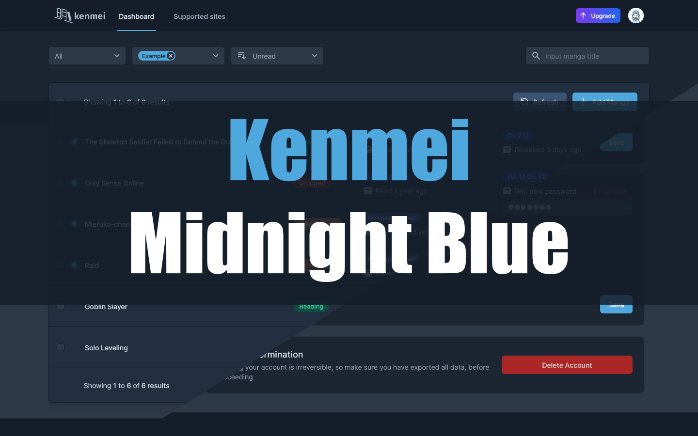
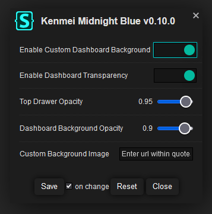
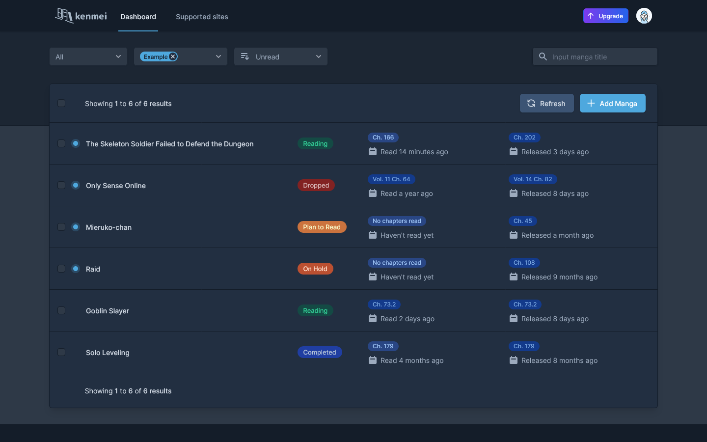
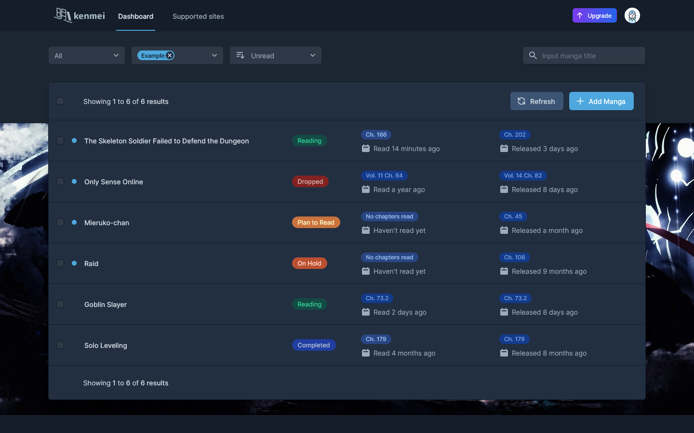
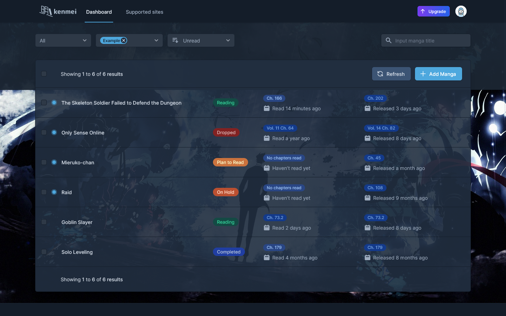
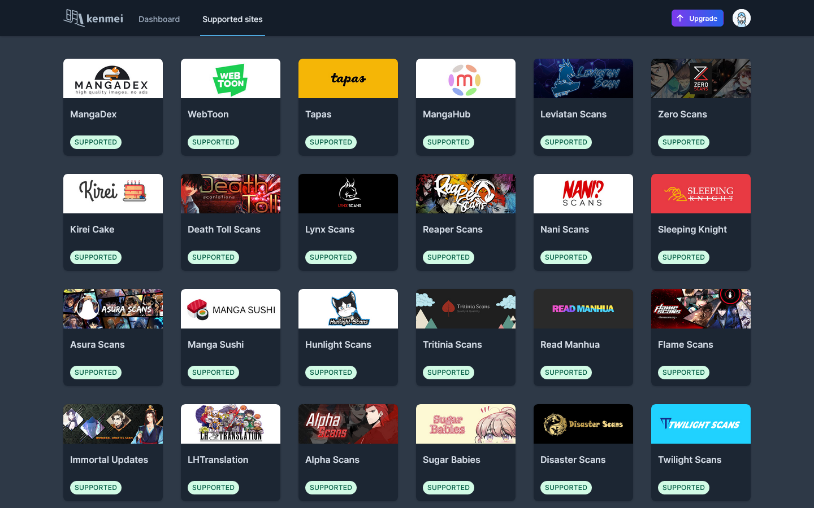
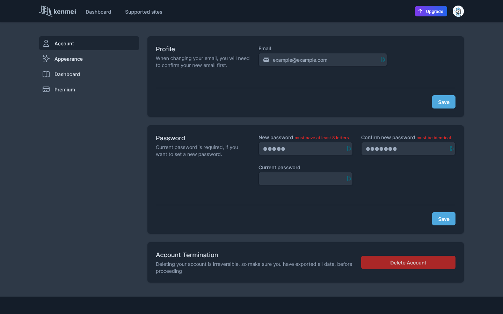
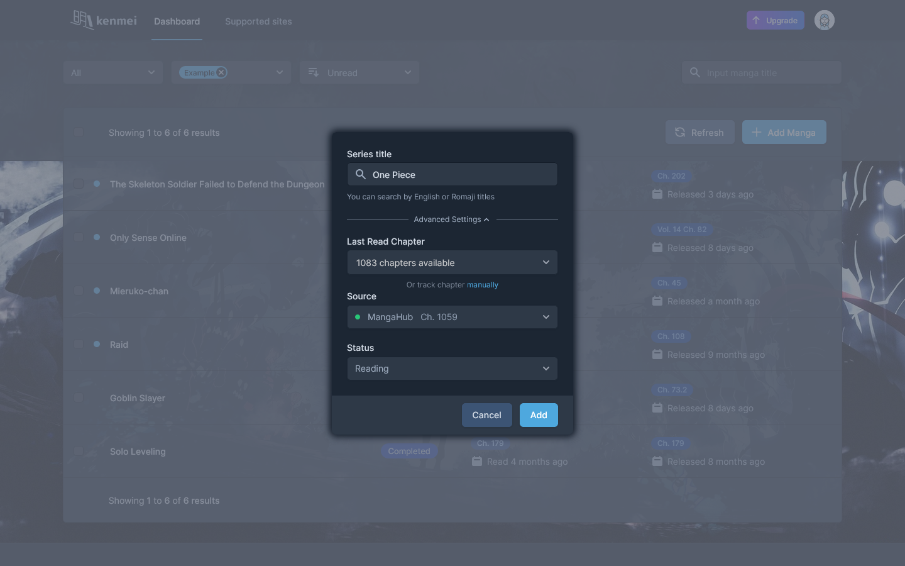

# Kenmei Midnight Blue

This is a dark userstyle for Kenmei with a blue color palette. It completely restyles all elements of the website to dark with slight tweaks to some elements to better fit in with the theme. 

  >Installs directly from this repository.
  >This is only available using Stylus (see the [documentation](https://github.com/openstyles/stylus/wiki/Usercss)).

## Features
* All element restyled in theme colors. 
* Option to customize your dashboard with a custom background image. (Please make sure to enter the URL within quotation marks to avoid errors) 
* Option to create a semi-transparent dashboard. (Only available to use alongside custom background image) 

## Install and setup
In order to use this theme or any other userstyles you will need to install a browser extension. I recommend using the Stylus extension.

### Browser extension:
Get the Stylus addon for:

### Install this theme:
Once you have installed the browser extension click on the link below to install this theme.

  >Installs directly from this repository.
  >This is only available using Stylus (see the [documentation](https://github.com/openstyles/stylus/wiki/Usercss)).

## Screenshots
### Dashboard

### Dashboard with Custom Background Image

### Dashboard with Custom Background Image and Transparency

### Supported Sites

### Settings

### Quick Add

## License
[GNU GPLv3](LICENSE)